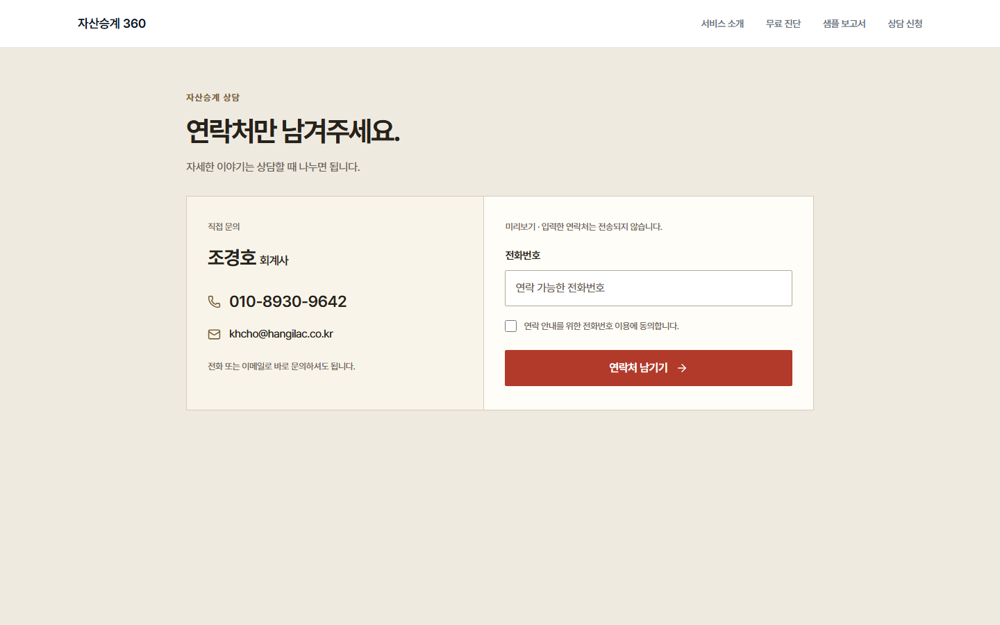
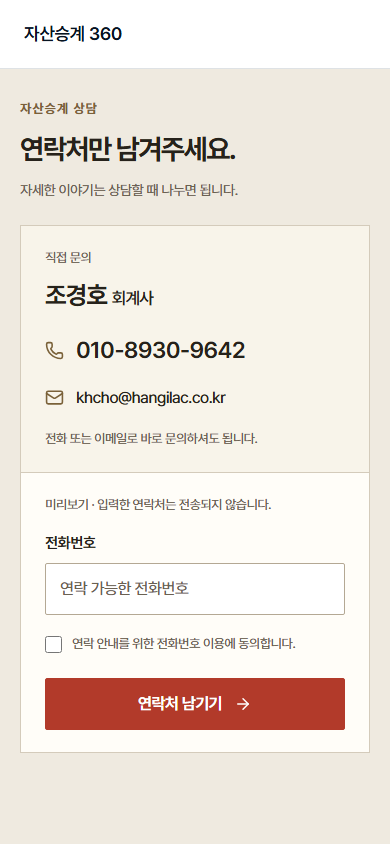
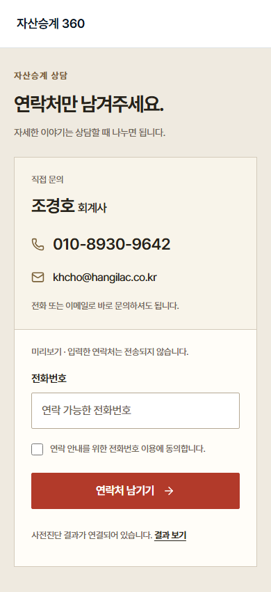
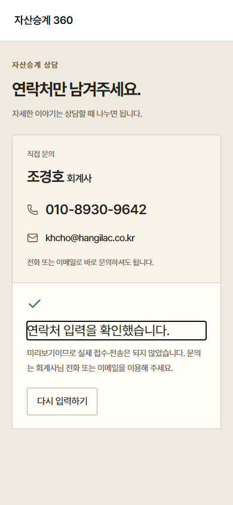
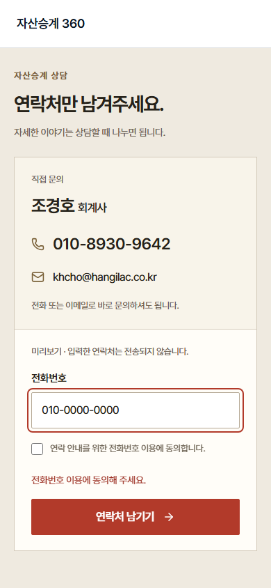
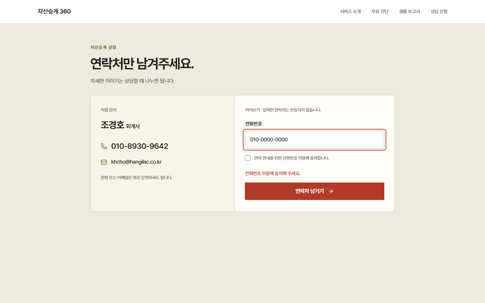

# 상담 페이지 간소화

대상: `/consultation` · 작업 브랜치: `codex/home-hero-paper-carousel`

## 변경 내용

- 긴 상담 소개, 사전진단 전체 요약, 진단 ID 카드, 접수번호와 후속 절차 목록을 제거했습니다.
- 방문자 입력은 **전화번호 한 칸 + 이용 동의**로 줄였습니다. 이름, 이메일, 연락 가능시간, 상담 희망내용은 받지 않습니다.
- 제출 버튼은 **연락처 남기기** 하나입니다.
- 사용자 요청으로 공개한 업무용 연락처: **조경호 회계사 · 010-8930-9642 · khcho@hangilac.co.kr**. 전화와 이메일 링크로 연결합니다. 테스트 과정에서 전화하거나 이메일을 발송하지 않았습니다.
- 메인페이지의 종이·먹색·인주색 계열을 상담 페이지에만 적용했습니다. 공통 내비게이션, 전문가 콘솔, 계산 엔진, PDF 구조, 4초 보고서 넘김은 수정하지 않았습니다.

## 진단 연결과 실제 접수의 구분

이번 연락처 전용 요청에 맞춰 사전진단을 **선행 필수 조건에서 선택 사항으로 변경**했습니다. 진단 없이도 연락처 입력이 가능합니다. 유효한 진단이 있으면 작은 `결과 보기` 링크로만 이어주며, URL의 진단 ID가 저장값과 다르면 연결하지 않습니다. 저장소 접근이 차단된 브라우저에서도 연락처 화면은 동작합니다.

**실제 접수 서버는 연결하지 않았습니다.** 입력 전과 입력 확인 후 모두 미전송 상태를 명확히 표시합니다. 가짜 접수번호, 접수 완료, 회신 예정 등의 표현은 사용하지 않습니다. 전화번호는 서버·메일·분석 도구로 전송하거나 브라우저 저장소에 보관하지 않으며, 확인 시 입력값을 비웁니다. 실제 문의는 표시된 전화 또는 이메일을 이용해야 합니다.

## 검증

- `npm run lint`: 통과.
- `npm run build`: 통과. TypeScript 검사 및 기존 경로와 `/sample-report` 정적 생성 성공.
- `npm run test:phase2b`: 28개 통과.
- `npm run test:smoke`: PC/모바일 9개 경로와 진단 → 결과 → 7장 보고서 → 연락처 흐름 통과.
- `node scripts/ui-audit.mjs`: 9개 경로와 대화형 전체 흐름을 PC/모바일에서 검사해 통과.
- `node scripts/sample-report-static-audit.mjs`: 기존 샘플 보고서 7장과 링크 검사 통과.
- `node scripts/consultation-contact-audit.mjs`: 375·390·430·768·1440px 통과.
  - 전화번호 한 칸, 제출 버튼 한 개, 첫 화면 내 CTA, 가로 넘침 없음.
  - 빈 값·문자·지나치게 짧거나 긴 번호 검증, 동의 검증, Enter 제출 및 오류/완료 포커스.
  - 진단 없음·유효한 진단·ID 불일치·브라우저 저장 차단.
  - 연락처 네트워크 전송 및 브라우저 저장 없음, 새로고침 시 전화번호 미복원.
- 로컬 정적 빌드의 실제 Chromium 캡처를 육안으로 확인했습니다. 모바일은 에뮬레이션이며 물리 기기 검수는 아닙니다.
- 합성 연락처 `000-0000-0000`만 입력 테스트에 사용했습니다. 고객 연락처, 비밀키, DB, 원시자료는 추가하지 않았습니다.

## 화면

### PC · 1440 × 900

### 모바일 · 390 × 844

### 진단 연결 시에도 짧게 유지

### 미전송 확인 상태

## 전화번호 자동 하이픈 및 검토 링크 공개

- 전화번호를 입력하거나 붙여넣으면 국내 번호에 하이픈을 자동 적용합니다. 합성 예시: `01000000000` → `010-0000-0000`. `02`와 지역번호 형식도 처리하고, 국제번호는 임의로 바꾸지 않습니다.
- 중간 숫자 선택·수정 시 커서를 유지하고, 하이픈 경계의 Backspace/Delete 및 전체 삭제를 지원합니다. 잘못된 문자나 과도하게 긴 입력을 잘라서 유효한 번호로 만들지 않고 기존 검증으로 안내합니다.
- 연속 붙여넣기에서 지연된 커서 이동이 다음 입력을 방해하던 문제를 발견해, 렌더 직후 동기적으로 커서를 복원하도록 수정했습니다.
- 이 변경 후 lint, build 및 5개 화면 크기의 연락처 검사를 다시 실행했습니다. 자동 구분자, 연속 입력, 중간 수정, 삭제, 검증, 미전송·미저장을 확인했습니다.
- 사용자가 **Vercel 검토 링크 제한 해제**를 명시적으로 승인하여, `frontend-prototype` 프로젝트의 Vercel Authentication을 해제했습니다. 프로젝트 설정 `ssoProtection`은 `all_except_custom_domains`에서 `null`로 바뀌었습니다. 이 프로젝트의 기존·향후 기본 배포 URL에 적용되는 접근 설정 변경이며, 특정 페이지에만 한정된 변경은 아닙니다.
- 기존 상담 Preview를 쿠키·인증 헤더 없이 요청하여 HTTP 200, 실제 상담 제목 표시, Vercel 로그인 페이지 미표시를 확인했습니다. GitHub 저장소는 `private: true`를 유지합니다.

Production 배포, main 직접 푸시 및 병합은 하지 않습니다. 최신 Preview URL은 최종 작업 보고에서 별도로 확인합니다. 연락처의 실제 접수 서버는 여전히 연결하지 않았습니다.
