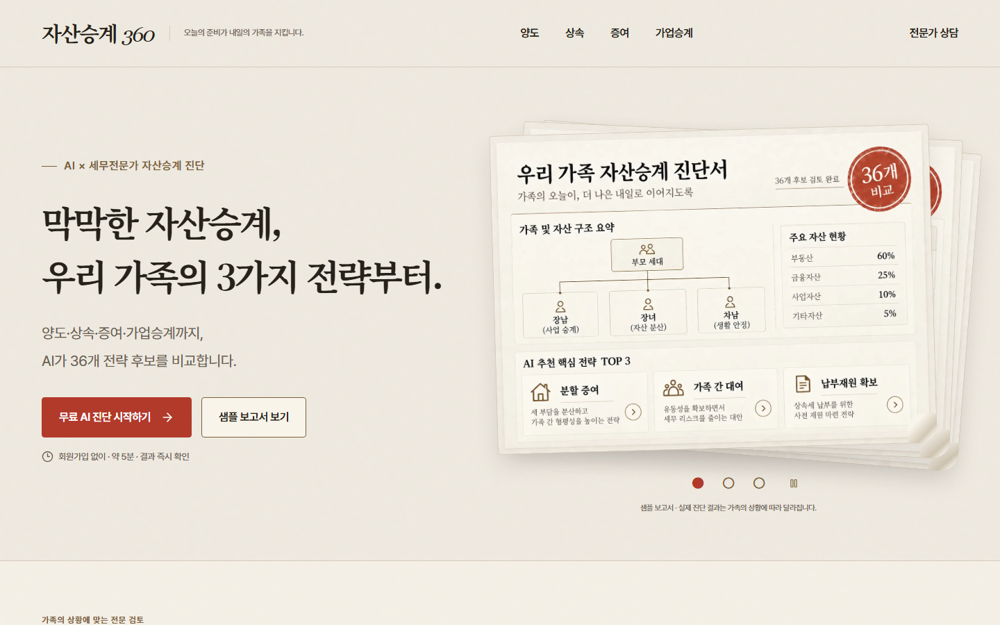
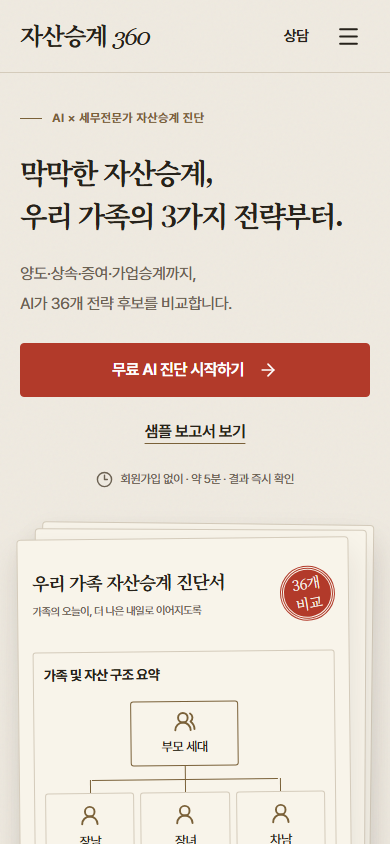
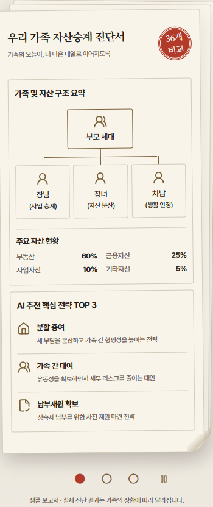
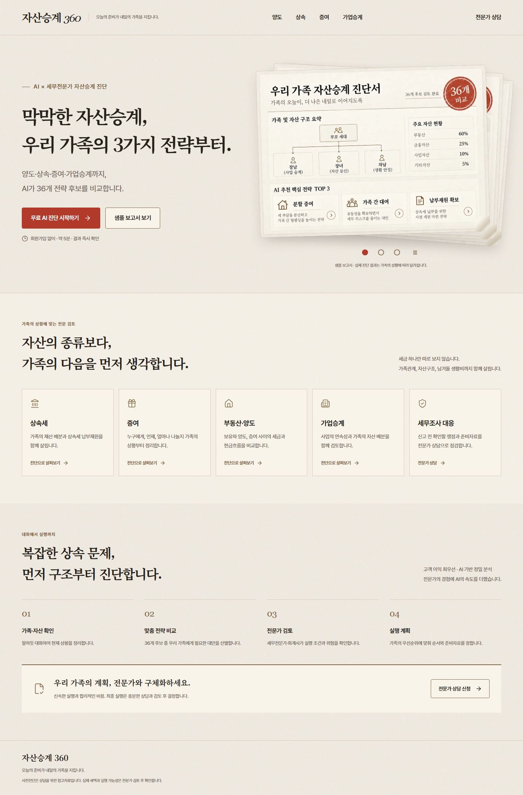
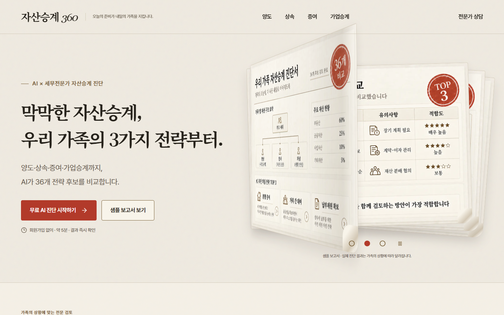
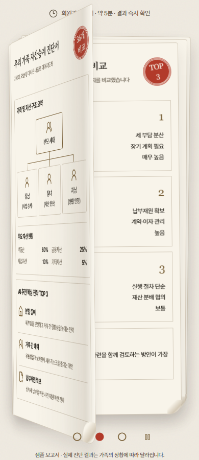

# Final paper hero implementation

Branch: `codex/home-hero-paper-carousel`

Approved image commit: `6f4cbbf67f52e24cea2e9f617b4cae972ef8b308`

## Changes

- Kept the explicit final brief's paper/ink/seal palette over the conflicting generic navy/blue suggestion. Homepage styles are isolated in `HomePage.module.css`; expert pages, calculation logic and report/PDF generation are unchanged.
- Header links: 양도, 상속, 증여, 가업승계, 전문가 상담. Mobile uses one header row and a dismissible menu.
- One primary CTA: **무료 AI 진단 시작하기** → `/precheck`. It opens the existing conversational diagnosis, including free-text input and fact confirmation. Category links preserve the existing `purpose` query routing and draft restoration.
- Secondary CTA: **샘플 보고서 보기** → `/precheck/result?demo=1`. Consultation links retain `/consultation`.
- Trust copy: **회원가입 없이 · 약 5분 · 결과 즉시 확인**. Service areas and consultation steps live below the hero rather than repeating value cards inside it.
- Three stacked report sheets use the supplied report WebP files on desktop. Below 1024px, the same approved content is reflowed as semantic HTML so the family tree, asset allocation, strategy conditions and roadmap remain readable. Whole-page reference images are never rendered as page content or backgrounds.
- Report 1 retains 장남 (사업 승계), 장녀 (자산 분산), 차남 (생활 안정), and 분할 증여. Report examples are labeled as samples, separate from calculated customer results.
- Four-second automatic advancement with a 680ms paper-leaf turn. The outgoing text remains on the lifted sheet until it reveals the next report. Dots, Left/Right/Home/End keys, horizontal swipe, hover/focus pause and explicit pause remain supported. Vertical touch scrolling does not change pages. Background tabs and reduced-motion preference pause automatic advancement. Print disables motion.
- No additional dependencies, account setup, production deployment or main-branch changes.

## Verification

- `npm run lint`: passed.
- `npm run typecheck`: passed.
- `npm run test:phase2b`: 28 tests passed.
- `npm run build`: passed; all existing routes exported.
- `npm run test:smoke`: passed across desktop/mobile and all nine routes, including the existing chat → result → report → consultation flow.
- `node scripts/home-hero-audit.mjs`: passed at 375, 390, 430, 768 and 1440px, all three reports at each size. No horizontal page overflow or clipped headline; two-line title and primary CTA visible on entry; report starts inside the initial viewport. Verified equal normalized report text across sizes, image paths, menu, live chat input, category selection, sample/consultation links and carousel controls.
- `node scripts/ui-audit.mjs`: passed for all nine existing routes plus the conversational flow at desktop and mobile sizes.
- Screenshots of all three sheets at all five sizes were generated. Desktop and mobile reference/implementation layouts were visually inspected. Representative evidence is committed below; temporary audit output stays in `.tmp/`.

The initial browser check found a 5px overflow from a rotated mobile back sheet. Reducing its rotation fixed the overflow without clipping content. UI capture pauses the carousel explicitly to avoid timing-dependent snapshots.

## Screenshots

## Paper-turn refinement (initial two-second version)

Re-ran lint, build (including TypeScript validation), and the complete homepage audit after the motion-only change. The broader unit/smoke/UI results above belong to the preceding final-design baseline.

Added `node scripts/paper-turn-audit.mjs`: passed at 375, 390, 430, 768 and 1440px. Observed automatic turn starts were 2,005–2,019ms apart. Sampled the actual CSS animation at 0, 170, 340, 510 and 670ms; no horizontal overflow occurred during the turn. Verified that the outgoing report stays attached to the turning sheet, reverse turns work, rapid key input settles on the latest page, reduced motion stops autoplay, and print hides the transient sheet. The visual duplicate is hidden from assistive technology.

Manually inspected desktop and mobile captures at 170ms and 340ms. These are deliberately paused animation frames, not static page layouts; the actual turn finishes in 680ms. Desktop captures use 1440 × 900 and motion-detail mobile captures use 390 × 900; the homepage regression separately covers the 390 × 844 initial viewport.

## Four-second reading interval (current)

Changed only the automatic advancement interval from two to four seconds, as requested after comparing the two designs. The 680ms paper turn, report content, layout and all controls are unchanged. Updated the timing regression test, including its reduced-motion observation window, for the longer interval.

Re-ran `npm run lint`, `npm run build` (including TypeScript), and `node scripts/paper-turn-audit.mjs`: all passed. The browser test measured four-second automatic turns at 375, 390, 430, 768 and 1440px and rechecked reverse turns, rapid manual input, mid-turn overflow, reduced motion and static print behavior. Temporary evidence is in `.tmp/paper-turn-four-seconds/`; the motion appearance remains represented by the screenshots above.

## Scope of evidence

Browser verification used the locally exported build. Screenshots represent Chromium desktop and emulated mobile viewports, not a physical iPhone/Android device. This change does not claim an externally verified Vercel deployment. No production deployment or main merge was performed.
